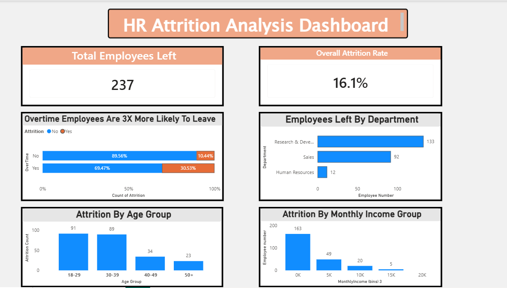

## 📊 Dashboard Preview

## 📌 Project Overview
This Power BI project analyzes HR data to uncover the key drivers behind employee attrition. The interactive dashboard helps identify high-risk segments and provides data-backed insights for improving employee retention strategies.

## 🎯 Key Insights
- **Overall Attrition Rate**: 16.1% with 237 employees who left
- **Overtime Impact**: Employees doing overtime are 3X more likely to leave. Attrition rate jumps from 10.44% to 30.53% with overtime
- **Department Wise**: R&D has highest exits at 133 employees, followed by Sales at 92 and HR at 12
- **Age Group Risk**: Highest attrition in 18-29 age group with 91 employees, followed by 30-39 with 89 employees
- **Income Factor**: Employees earning 0-5K monthly show highest attrition with 168 cases

## 🛠️ Tools & Skills Used
- **Tool**: Power BI Desktop, DAX
- **Skills**: Data Cleaning, Data Modeling, DAX Measures, Data Visualization, HR Analytics, Business Intelligence

## 📁 Files in This Repo
- `HR-Attrition-Dashboard.pbix` → Download & explore the interactive dashboard
- `dashboard-screenshot.png` → Dashboard preview image

---
*Created by Prerna Yogi | Aspiring Data Analyst*
